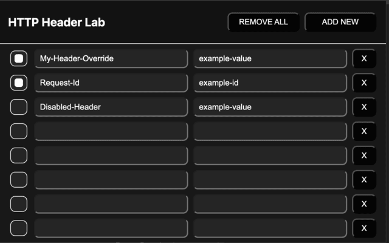

# Http Header Lab

Google Chrome extension for adding and toggling custom HTTP headers on outgoing requests.



## Package

```bash
zip ./http-header-lab.zip ./manifest.json ./popup/** ./images/** ./worker/**
```
